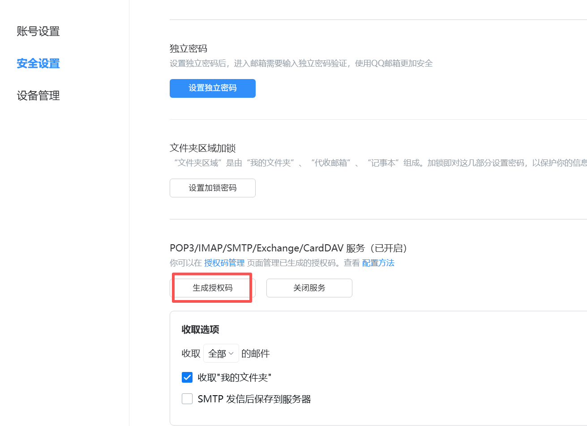
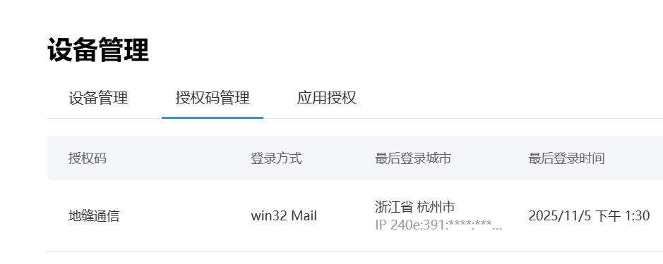
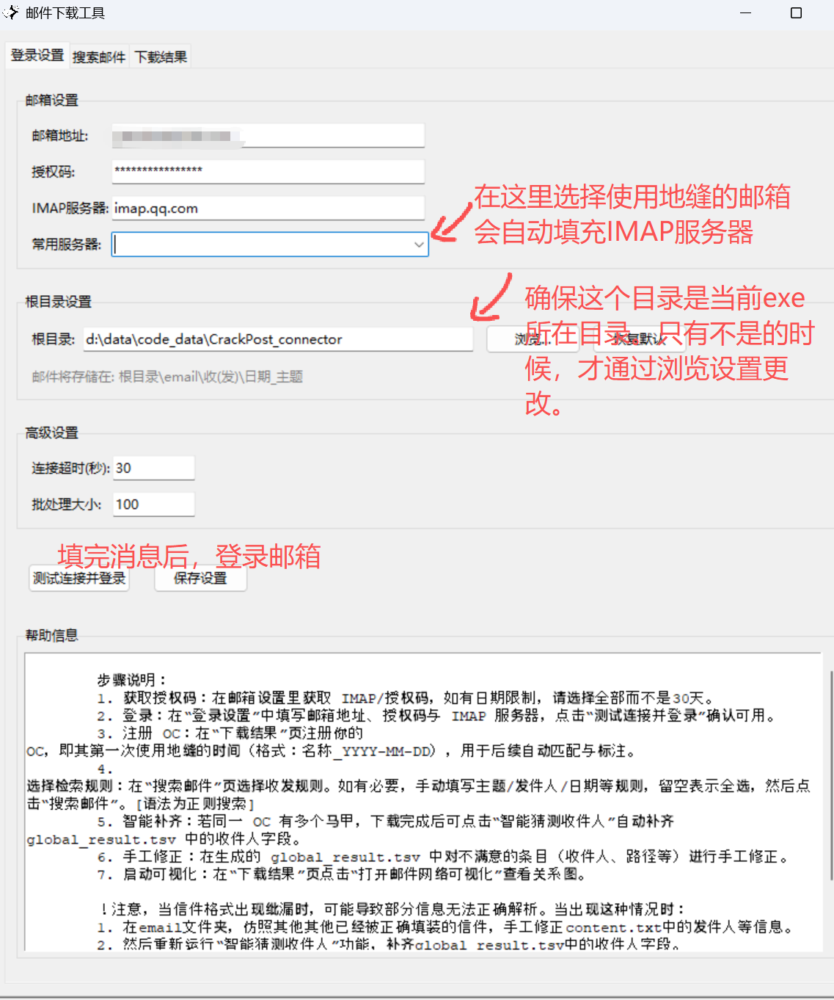
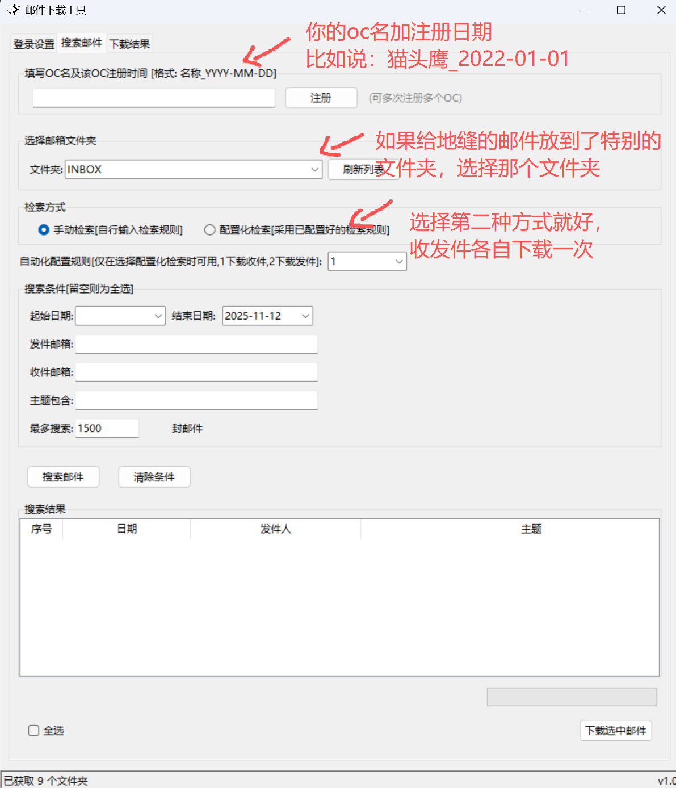
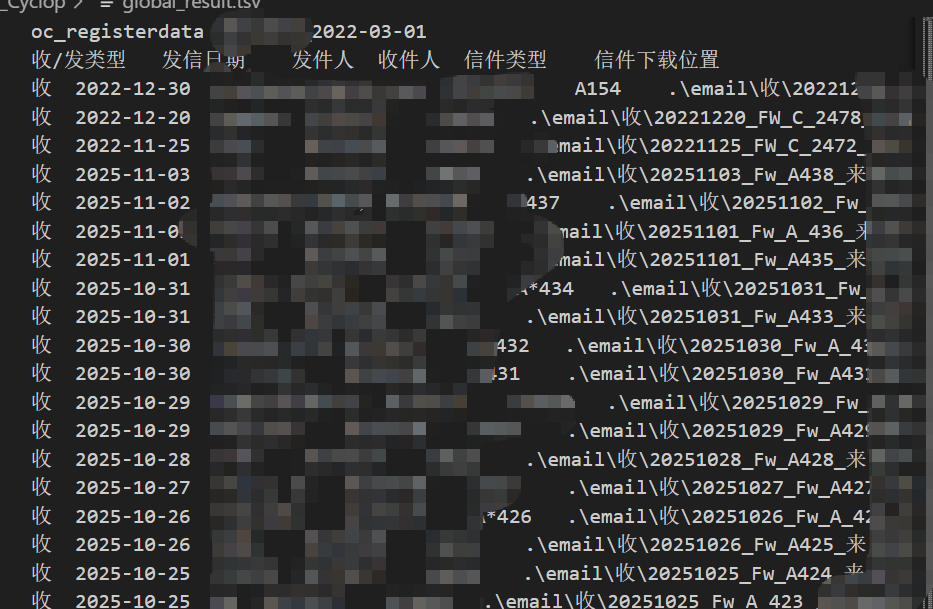

1. 通过对应邮箱的设置选项获得IMAP授权码
   1. 
   2. 
   3. 如果有日期限制，请确保日期选择为全部而不是30天
2. 打开exe程序，输入授权码、邮箱号并选择邮箱类型。如果常用邮箱内没有你的邮箱，再填写
   1. 
3. 选择页操作如下
   1. 
   2. 这里可能会弹出一些被过滤掉的邮件
   3. 一般来说是格式错误导致，当然如果出现大范围的格式错误，可以反馈！
4. 下载后，确保email邮箱内的邮件下载成功
   1. tsv文件相当于是一个目录。如果邮件格式有误，可以在这里修正
   2. 保证收发件和email地址正确即可！可以用任何文本编辑器打开tsv，例如txt
   3. 
   4. 注册的oc和所有的信件都在这里。确保一切无误后，打开html网页文件或通过打开邮件网络可视化即可。然后选择email文件夹上传所有文件！
5. 玩的开心！